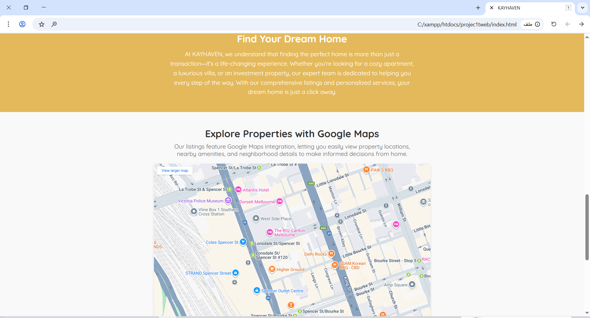
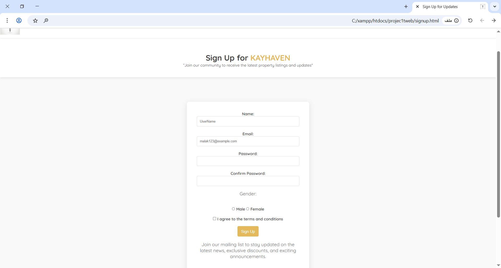

# 📌 Project Name: **Basic Website**

✨ **Description**  
A simple and responsive multipurpose website template. This project is ideal for personal portfolios, small businesses, or educational use. Built using pure HTML, CSS, and JavaScript, it demonstrates clean structure, responsiveness, and basic interactivity.

---

## 🚀 Features

- Responsive design optimized for desktop, tablet, and mobile.
- Hero section with a welcoming headline.
- Services/Features section to showcase offerings.
- Image/gallery section to highlight content.
- Contact form with basic validation.
- Footer with contact details and social icons.
- Lightweight and fast loading (HTML, CSS, JS only).

---

## 🛠️ Tech Stack

- **HTML5** – Structure and semantic content.
- **CSS3** – Styling, layout, and responsive design.
- **JavaScript (Vanilla JS)** – Under maintenance.

---

## ⚙️ Installation

1. Clone this repository:
   ```bash
   git clone https://github.com/your-username/basic-website.git
   ```
2. Navigate to the project folder:
   ```bash
   cd basic-website
   ```
3. Open `index.html` in any modern browser.

---

## 📸 Screenshots

  

  


---

## 📄 License

```markdown
⚠️ This project is still under development and may be updated frequently.  
This project is open-source and free to use for learning and personal projects.
```
